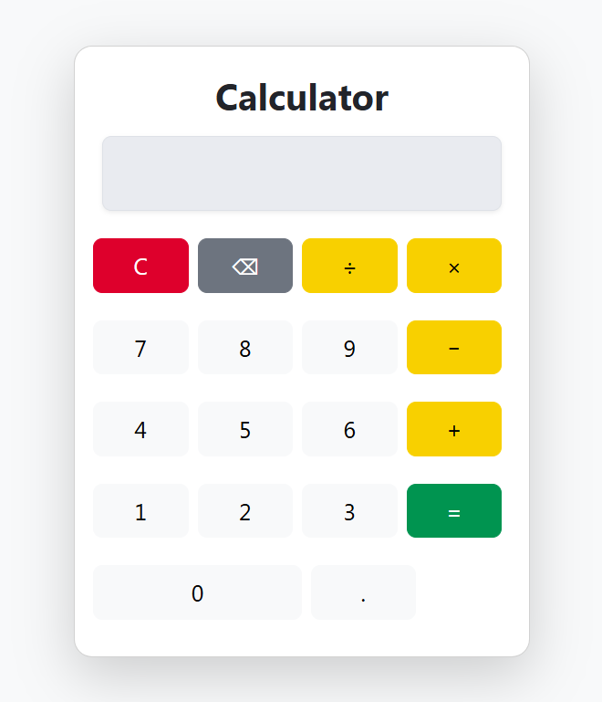

git # Calculator Project

A simple JavaScript calculator with keyboard support, live on GitHub Pages.

## Features
- Add, subtract, multiply, divide
- Keyboard support for numbers, operators, Enter, Backspace, Escape
- Handles decimal numbers
- Clear and backspace functionality

## Live Demo
[Click here to use the calculator](https://warda-create.github.io/calculator-project/)

## Screenshot

## Technologies Used
- HTML
- CSS (Bootstrap)
- JavaScript